我来为你编写一份完整的苗木售卖微信小程序需求文档，包含详细的功能模块和图形化展示。

---

# 🌳 苗木售卖微信小程序需求文档

## 📋 文档信息

| 项目 | 内容 |
|------|------|
| **项目名称** | 苗木易购小程序 |
| **文档版本** | V1.0 |
| **创建日期** | 2025-01-XX |
| **目标平台** | 微信小程序 |
| **技术栈** | 前端：Uniapp + uView、JavaScript<br>后端：Spring Boot + MySQL + MyBatis<br>其他：微信支付、微信物流助手 |

---

## 一、项目概述

### 1.1 项目背景

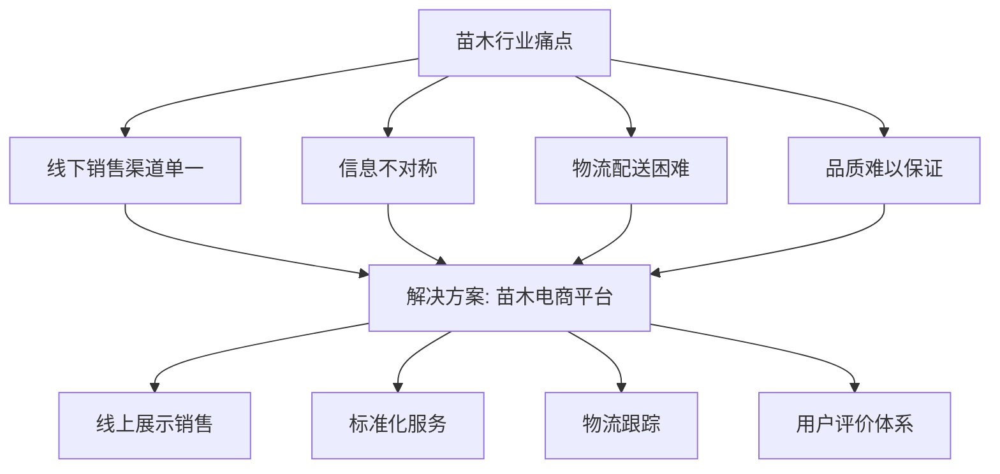


随着园林绿化、家庭园艺市场的快速发展，传统苗木销售存在以下问题：
- **信息不透明**：买家难以获取准确的苗木规格、价格信息
- **渠道受限**：苗圃主要依赖线下批发，零售渠道有限
- **物流复杂**：苗木运输需要专业的包装和配送
- **信任缺失**：买家担心苗木质量与描述不符

本项目旨在打造一个专业、便捷的苗木在线交易平台，连接苗圃与消费者。

### 1.2 产品定位

**目标用户群体**：
- 🏡 **个人用户**：家庭园艺爱好者、庭院绿化需求者
- 🏢 **企业用户**：园林工程公司、物业公司、景观设计公司
- 🌾 **供应商**：苗圃基地、苗木经纪人、种植大户

**核心价值**：
- ✅ 品种齐全：涵盖观赏植物、果树苗木、绿化苗木等
- ✅ 品质保障：实名认证、实地验货、用户评价
- ✅ 专业服务：种植指导、养护建议、售后保障
- ✅ 便捷交易：在线下单、物流跟踪、支付安全

---

## 二、功能需求

### 2.1 整体功能架构

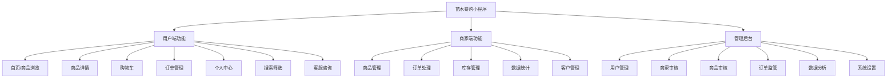


### 2.2 用户端功能模块

#### 2.2.1 首页模块

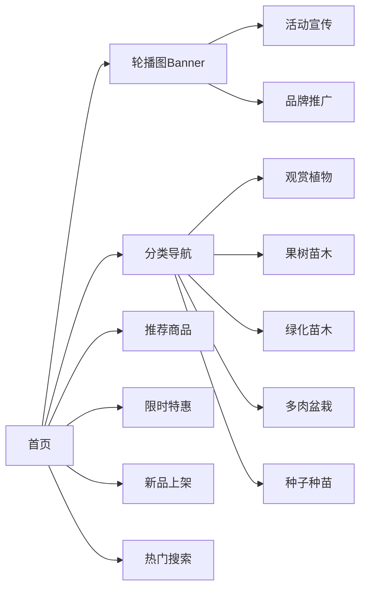


**功能清单**：

| 功能点 | 说明 | 优先级 |
|--------|------|--------|
| 轮播图 | 展示促销活动、热门品种、平台公告 | P0 |
| 分类导航 | 快速进入各苗木品类页面 | P0 |
| 推荐商品 | 根据用户浏览历史智能推荐 | P1 |
| 限时特惠 | 倒计时展示特价商品 | P1 |
| 新品上架 | 展示最新上架的苗木 | P1 |
| 搜索入口 | 支持关键词搜索 | P0 |
| 公告栏 | 滚动显示平台通知 | P2 |

**页面布局示意**：
```
┌─────────────────────┐
│   🔍 搜索框          │
├─────────────────────┤
│  [轮播图 Banner]     │
│  ◄ ● ● ● ►         │
├─────────────────────┤
│ 🌸观赏 🌳果树 🌿绿化 │
│ 🌵多肉 🌱种子 更多▼  │
├─────────────────────┤
│ ⚡ 限时特惠 (倒计时)  │
│ ┌───┐ ┌───┐ ┌───┐  │
│ │图 │ │图 │ │图 │  │
│ │¥88│ │¥56│ │¥99│  │
│ └───┘ └───┘ └───┘  │
├─────────────────────┤
│ 🆕 新品上架          │
│ ┌───┐ ┌───┐ ┌───┐  │
│ │商 │ │商 │ │商 │  │
│ └───┘ └───┘ └───┘  │
├─────────────────────┤
│ ⭐ 热门推荐          │
│ (瀑布流无限加载)      │
└─────────────────────┘
```


---

#### 2.2.2 商品列表与筛选模块

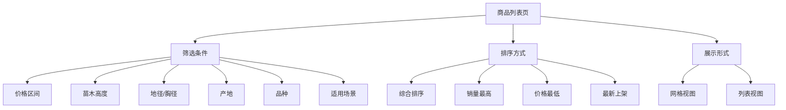


**筛选维度设计**：

| 筛选项 | 类型 | 示例值 |
|--------|------|--------|
| 价格区间 | 范围选择 | 0-50元、50-100元、100-500元、500元以上 |
| 苗木高度 | 多选 | 10cm以下、10-30cm、30-50cm、50-100cm、1m以上 |
| 地径/胸径 | 范围 | 1cm以下、1-3cm、3-5cm、5-10cm、10cm以上 |
| 产地 | 多选 | 江苏、浙江、山东、河南、广东等 |
| 品种标签 | 多选 | 常绿、落叶、观花、观叶、果树、盆景 |
| 适用场景 | 多选 | 庭院、阳台、办公室、公园、道路绿化 |
| 起售数量 | 单选 | 1株起售、批量优惠 |

**交互流程**：
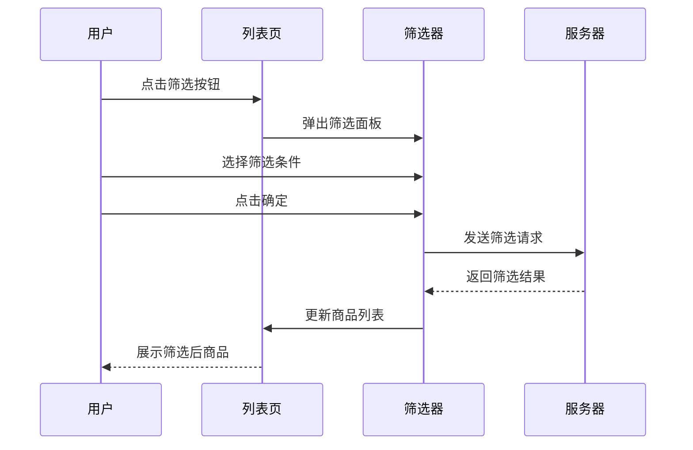


---

#### 2.2.3 商品详情模块

```mermaid
graph TB
    A[商品详情页] --> B[商品图片/视频]
    A --> C[基本信息]
    A --> D[规格参数]
    A --> E[价格库存]
    A --> F[配送信息]
    A --> G[商家信息]
    A --> H[用户评价]
    A --> I[相关推荐]
    
    B --> B1[多图轮播]
    B --> B2[细节展示]
    B --> B3[实拍视频]
    
    C --> C1[商品名称]
    C --> C2[商品简介]
    C --> C3[收藏/分享]
    
    D --> D1[高度/冠幅]
    D --> D2[地径/胸径]
    D --> D3[树龄]
    D --> D4[生长习性]
    D --> D5[适宜季节]
    
    E --> E1[单价]
    E --> E2[批量优惠价]
    E --> E3[库存数量]
    E --> E4[起售数量]
    
    F --> F1[运费计算]
    F --> F2[发货地]
    F --> F3[预计到达时间]
    F --> F4[配送方式]
    
    G --> G1[店铺名称]
    G --> G2[商家评分]
    G --> G3[认证商家标识]
    G --> G4[联系客服]
    
    H --> H1[评价列表]
    H --> H2[晒图展示]
    H --> H3[好评率]
```


**页面结构**：
```
┌─────────────────────┐
│  [商品图片轮播]       │
│  ◄ 1/8 ►            │
│  [📹 查看实拍视频]    │
├─────────────────────┤
│ ¥88.00  💰 批量优惠  │
│ 已售 256 件  库存充足 │
├─────────────────────┤
│ 桂花树 四季桂 庭院    │
│ 盆栽地栽皆可 浓香型   │
│ ⭐ 收藏  ↗️ 分享     │
├─────────────────────┤
│ 📏 规格选择           │
│ ○ 高30-50cm  ¥88    │
│ ○ 高50-80cm  ¥128   │
│ ● 高80-100cm ¥168   │
│ ○ 高100-150cm ¥268  │
├─────────────────────┤
│ 📦 购买数量: [- 2 +] │
│    起售: 1株         │
├─────────────────────┤
│ [加入购物车] [立即购买]│
├─────────────────────┤
│ 📋 商品详情           │
│ 📝 规格参数           │
│ 🚚 配送说明           │
│ ⭐ 用户评价(128)      │
│ 🏪 店铺信息           │
└─────────────────────┘
```


**核心字段说明**：

| 字段 | 类型 | 说明 |
|------|------|------|
| 商品名称 | String | 如"桂花树 四季桂 庭院绿化苗木" |
| 商品图片 | Array | 主图+详情图，最多9张 |
| 商品视频 | String | 可选，实拍视频URL |
| 价格 | Decimal | 单株价格 |
| 批量价格 | Array | 如[{数量:10,价格:80},{数量:50,价格:70}] |
| 库存 | Integer | 可售数量 |
| 规格参数 | Object | {高度,冠幅,地径,胸径,树龄,品种} |
| 生长习性 | Text | 光照、水分、土壤、温度要求 |
| 适宜种植季节 | String | 如"春季、秋季" |
| 发货地 | String | 省市区 |
| 运费模板 | Object | 运费规则 |
| 售后服务 | String | 退换货政策 |

---

#### 2.2.4 购物车模块

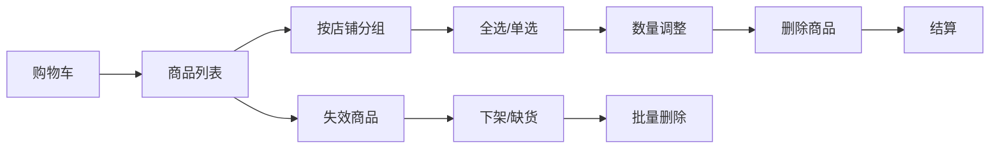


**功能清单**：

| 功能 | 说明 | 交互方式 |
|------|------|----------|
| 添加商品 | 从详情页加入购物车 | 点击"加入购物车"按钮 |
| 修改数量 | 增减购买数量 | +/- 按钮或直接输入 |
| 选中商品 | 勾选需要结算的商品 | 复选框 |
| 全选/取消全选 | 一键选中所有商品 | 顶部全选按钮 |
| 删除商品 | 移除不需要的商品 | 左滑删除或编辑模式 |
| 移入收藏夹 | 暂不购买但想保留 | 长按或编辑菜单 |
| 失效商品展示 | 显示下架/缺货商品 | 置灰显示，可批量删除 |
| 实时计算总价 | 根据选中商品计算 | 自动更新 |

**页面布局**：
```
┌─────────────────────┐
│ ☑️ 全选  ✏️ 编辑     │
├─────────────────────┤
│ 🏪 绿意苗圃 [进店>]  │
│ ☑️ [x] 商品图片      │
│    桂花树 高80-100cm │
│    ¥168 × 2         │
│    [- 2 +]  [删除]   │
│                      │
│ ☑️ [x] 商品图片      │
│    樱花树苗 高50cm   │
│    ¥45 × 5          │
│    [- 5 +]  [删除]   │
├─────────────────────┤
│ 🏪 花木世界 [进店>]  │
│ ☑️ [x] 商品图片      │
│    多肉组合盆栽      │
│    ¥68 × 1          │
│    [- 1 +]  [删除]   │
├─────────────────────┤
│ 合计: ¥611.00       │
│ 已选3件              │
│ [去结算(3)]          │
└─────────────────────┘
```


---

#### 2.2.5 订单模块

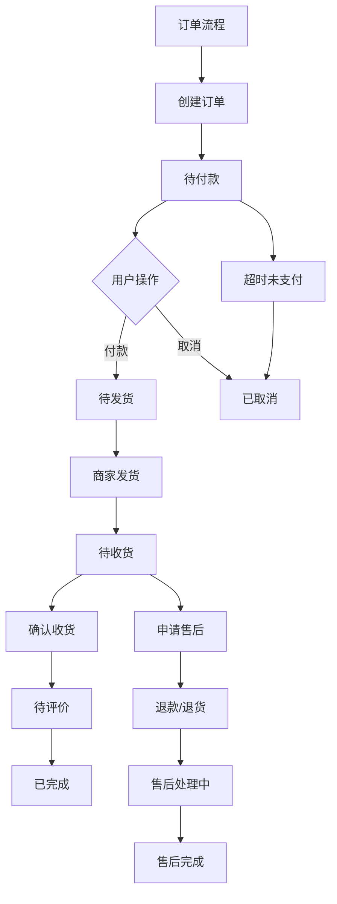


**订单状态流转**：

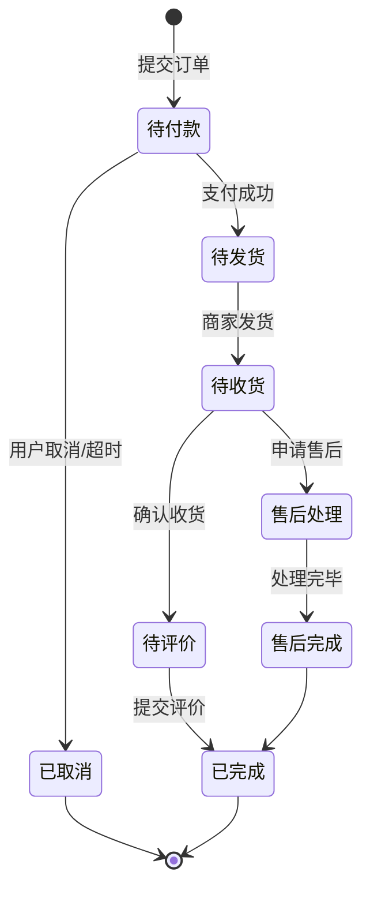


**订单列表页**：

| Tab标签 | 说明 | 角标 |
|---------|------|------|
| 全部 | 所有订单 | - |
| 待付款 | 需在规定时间内支付 | 显示数量 |
| 待发货 | 已付款等待商家发货 | 显示数量 |
| 待收货 | 已发货等待确认 | 显示数量 |
| 待评价 | 已完成可评价 | 显示数量 |
| 售后/退款 | 正在处理的售后 | 显示数量 |

**订单详情字段**：

```
┌─────────────────────┐
│ 订单状态: 待发货      │
│ 订单号: 20250115XXX  │
│ 下单时间: 2025-01-15 │
├─────────────────────┤
│ 收货人: 张三         │
│ 电话: 138****1234    │
│ 地址: XX省XX市XX区   │
│      XX路XX号        │
├─────────────────────┤
│ 🏪 绿意苗圃          │
│ ┌─────────────────┐ │
│ │ [图] 桂花树      │ │
│ │ 规格: 高80-100cm │ │
│ │ ¥168 × 2        │ │
│ └─────────────────┘ │
│ ┌─────────────────┐ │
│ │ [图] 樱花树苗    │ │
│ │ 规格: 高50-80cm  │ │
│ │ ¥88 × 3         │ │
│ └─────────────────┘ │
├─────────────────────┤
│ 商品总额: ¥600.00   │
│ 运费: ¥20.00        │
│ 优惠: -¥15.00       │
│ 实付: ¥605.00       │
├─────────────────────┤
│ [联系商家] [查看物流] │
└─────────────────────┘
```


**订单操作**：

| 状态 | 可执行操作 |
|------|-----------|
| 待付款 | 去支付、取消订单、修改地址 |
| 待发货 | 提醒发货、申请退款、联系商家 |
| 待收货 | 查看物流、确认收货、申请售后 |
| 待评价 | 去评价、查看评价 |
| 已完成 | 再次购买、申请售后（期限内） |
| 已取消 | 删除订单、再次购买 |

---

#### 2.2.6 搜索模块

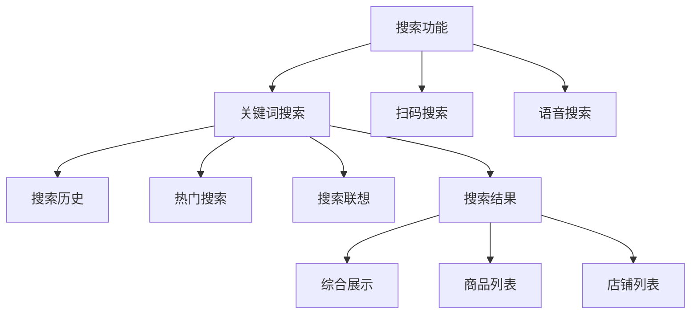


**搜索页面结构**：
```
┌─────────────────────┐
│ 🔍 [输入关键词    ] │
├─────────────────────┤
│ 🔥 热门搜索          │
│ 🏷️ 桂花  🏷️ 樱花   │
│ 🏷️ 多肉  🏷️ 果树   │
├─────────────────────┤
│ 🕐 搜索历史    [清空]│
│ • 桂花树             │
│ • 多肉植物           │
│ • 苹果树苗           │
└─────────────────────┘

输入关键词后:
┌─────────────────────┐
│ 🔍 桂花树         ✕ │
├─────────────────────┤
│ 💡 桂花树 高1米      │
│ 💡 桂花树 盆栽       │
│ 💡 桂花树 四季桂     │
│ 💡 桂花树 金桂       │
└─────────────────────┘
```


**搜索功能特性**：

| 功能 | 说明 |
|------|------|
| 模糊搜索 | 支持部分匹配 |
| 智能联想 | 输入时实时提示 |
| 历史记录 | 保存最近20条搜索 |
| 热门搜索 | 展示当前热门标签 |
| 纠错提示 | 错别字智能纠正 |
| 多维度展示 | 商品、店铺、分类 |

---

#### 2.2.7 个人中心模块

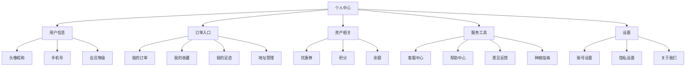


**页面布局**：
```
┌─────────────────────┐
│ 👤 [头像] 用户名     │
│    普通会员          │
│    [会员中心 >]      │
├─────────────────────┤
│ 💰 余额  🎫 优惠券  │
│  ¥128.00     5张    │
│                     │
│ ⭐ 积分    📦 包裹  │
│  1280      待收货2  │
├─────────────────────┤
│ 【我的订单】 查看全部>│
│ ┌───┬───┬───┬───┐  │
│ │待付 │待发 │待收 │待评│ │
│ │  1  │  2  │  3  │ 0 │ │
│ └───┴───┴───┴───┘  │
├─────────────────────┤
│ 📍 地址管理          │
│ ❤️ 我的收藏          │
│ 👀 浏览足迹          │
│ 🌱 种植日记          │
│ 🎁 邀请好友          │
│ 📞 客服中心          │
│ ⚙️  设置            │
└─────────────────────┘
```


---

### 2.3 商家端功能模块

> 注：商家端可以做成独立的管理端小程序或集成在用户端（角色切换）

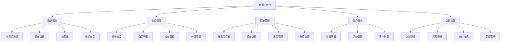


**核心功能说明**：

| 模块 | 功能点 | 详细说明 |
|------|--------|----------|
| 商品管理 | 发布商品 | 填写商品信息、上传图片、设置价格和库存 |
| 商品管理 | 上下架 | 批量上下架操作 |
| 商品管理 | 库存预警 | 库存低于阈值时提醒补货 |
| 订单管理 | 订单列表 | 按状态筛选查看订单 |
| 订单管理 | 发货操作 | 填写物流单号、选择物流公司 |
| 订单管理 | 打印面单 | 对接电子面单打印 |
| 订单管理 | 批量操作 | 批量发货、批量导出 |
| 售后服务 | 退款处理 | 审核退款申请 |
| 售后服务 | 退货处理 | 确认收货、退款 |
| 数据统计 | 销售报表 | 日/周/月销售数据 |
| 数据统计 | 商品分析 | 浏览量、转化率分析 |
| 数据统计 | 客户分析 | 新老客户占比、复购率 |

---

### 2.4 管理后台功能（Web端）

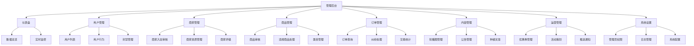


---

## 三、数据库设计要点

### 3.1 核心数据表

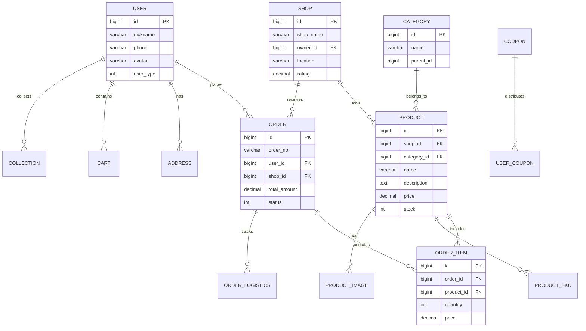


### 3.2 关键表结构

#### （1）用户表（user）

| 字段名 | 类型 | 说明 |
|--------|------|------|
| id | BIGINT | 主键 |
| openid | VARCHAR(64) | 微信openid |
| nickname | VARCHAR(64) | 昵称 |
| avatar | VARCHAR(255) | 头像URL |
| phone | VARCHAR(20) | 手机号 |
| user_type | TINYINT | 用户类型：0普通用户 1商家 2管理员 |
| status | TINYINT | 状态：0正常 1禁用 |
| create_time | DATETIME | 创建时间 |

#### （2）商品表（product）

| 字段名 | 类型 | 说明 |
|--------|------|------|
| id | BIGINT | 主键 |
| shop_id | BIGINT | 店铺ID |
| category_id | BIGINT | 分类ID |
| name | VARCHAR(200) | 商品名称 |
| images | TEXT | 图片JSON数组 |
| video | VARCHAR(255) | 视频URL |
| description | TEXT | 商品详情 |
| price | DECIMAL(10,2) | 价格 |
| original_price | DECIMAL(10,2) | 原价 |
| stock | INT | 库存 |
| sales | INT | 销量 |
| specs | JSON | 规格参数 |
| planting_guide | TEXT | 种植指南 |
| status | TINYINT | 状态：0下架 1上架 2审核中 |
| sort | INT | 排序 |
| create_time | DATETIME | 创建时间 |

#### （3）订单表（orders）

| 字段名 | 类型 | 说明 |
|--------|------|------|
| id | BIGINT | 主键 |
| order_no | VARCHAR(64) | 订单号 |
| user_id | BIGINT | 用户ID |
| shop_id | BIGINT | 店铺ID |
| total_amount | DECIMAL(10,2) | 订单总额 |
| pay_amount | DECIMAL(10,2) | 实付金额 |
| freight | DECIMAL(10,2) | 运费 |
| discount | DECIMAL(10,2) | 优惠金额 |
| status | TINYINT | 订单状态 |
| receiver_name | VARCHAR(50) | 收货人姓名 |
| receiver_phone | VARCHAR(20) | 收货电话 |
| receiver_address | VARCHAR(500) | 收货地址 |
| logistics_company | VARCHAR(50) | 物流公司 |
| logistics_no | VARCHAR(64) | 物流单号 |
| pay_time | DATETIME | 支付时间 |
| delivery_time | DATETIME | 发货时间 |
| receive_time | DATETIME | 收货时间 |
| create_time | DATETIME | 创建时间 |

#### （4）商品SKU表（product_sku）

| 字段名 | 类型 | 说明 |
|--------|------|------|
| id | BIGINT | 主键 |
| product_id | BIGINT | 商品ID |
| sku_name | VARCHAR(100) | SKU名称（如"高80-100cm"） |
| height_range | VARCHAR(50) | 高度范围 |
| diameter | VARCHAR(50) | 直径/地径 |
| price | DECIMAL(10,2) | 价格 |
| stock | INT | 库存 |
| image | VARCHAR(255) | SKU对应图片 |

---

## 四、非功能性需求

### 4.1 性能要求

| 指标 | 要求 | 说明 |
|------|------|------|
| 首屏加载时间 | < 2秒 | 首页首次加载 |
| 页面切换响应 | < 500ms | 页面跳转响应时间 |
| 接口响应时间 | < 1秒 | 95%的请求在1秒内响应 |
| 并发支持 | 1000 QPS | 支持高峰期访问 |
| 图片加载 | 懒加载+CDN | 优化图片加载速度 |

### 4.2 安全性要求

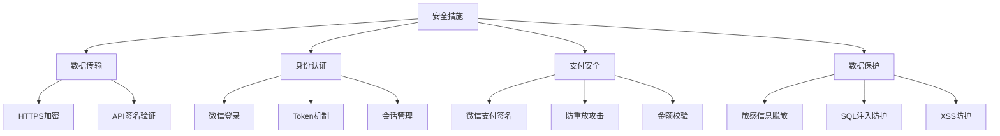


**安全规范**：

| 安全项 | 措施 |
|--------|------|
| 用户隐私 | 手机号、地址加密存储 |
| 支付安全 | 使用微信支付官方SDK，二次验证 |
| 接口安全 | JWT Token认证，请求签名 |
| 数据备份 | 每日自动备份数据库 |
| 防刷机制 | 接口限流、验证码 |
| 日志审计 | 记录关键操作日志 |

### 4.3 兼容性要求

| 维度 | 要求 |
|------|------|
| 微信版本 | 支持微信7.0及以上版本 |
| 操作系统 | iOS 10+、Android 5.0+ |
| 屏幕适配 | 支持主流手机屏幕尺寸 |
| 网络环境 | 适配4G/5G/WiFi，弱网优化 |

### 4.4 可用性要求

| 指标 | 要求 |
|------|------|
| 系统可用率 | ≥ 99.5% |
| 故障恢复时间 | < 30分钟 |
| 数据准确率 | 100% |
| 用户满意度 | ≥ 4.5分（5分制） |

---

## 五、UI/UX设计规范

### 5.1 设计风格

**设计理念**：自然、清新、专业

```
配色方案:
┌─────────────────────────────┐
│ 主色调: 🟢 绿色 #07C160     │
│ 辅助色: 🟤 棕色 #8B4513     │
│ 强调色: 🟠 橙色 #FF6B35     │
│ 背景色: ⚪ 浅灰 #F5F5F5     │
│ 文字色: ⚫ 深灰 #333333     │
└─────────────────────────────┘
```


**色彩应用**：

| 颜色 | 色值 | 应用场景 |
|------|------|----------|
| 主绿色 | #07C160 | 按钮、价格、重要标识 |
| 深绿色 | #06AD56 | 悬停状态、强调 |
| 棕色 | #8B4513 | 土壤、树干相关元素 |
| 橙色 | #FF6B35 | 促销、优惠、警告 |
| 浅灰色 | #F5F5F5 | 页面背景 |
| 深灰色 | #333333 | 主要文字 |
| 中灰色 | #666666 | 次要文字 |
| 浅灰色 | #999999 | 提示文字 |

### 5.2 字体规范

| 用途 | 字体大小 | 字重 | 行高 |
|------|----------|------|------|
| 标题 | 32rpx | Bold | 1.5 |
| 副标题 | 28rpx | Medium | 1.5 |
| 正文 | 26rpx | Regular | 1.6 |
| 辅助文字 | 24rpx | Regular | 1.5 |
| 价格 | 36rpx | Bold | 1.4 |
| 按钮文字 | 28rpx | Medium | 1.4 |

### 5.3 图标规范

- **风格**：线性图标，圆角统一
- **尺寸**：48rpx × 48rpx（标准）、32rpx × 32rpx（小）
- **颜色**：默认灰色，激活状态绿色
- **库**：使用 IconFont 自定义图标库

---

## 六、业务流程

### 6.1 用户购物流程

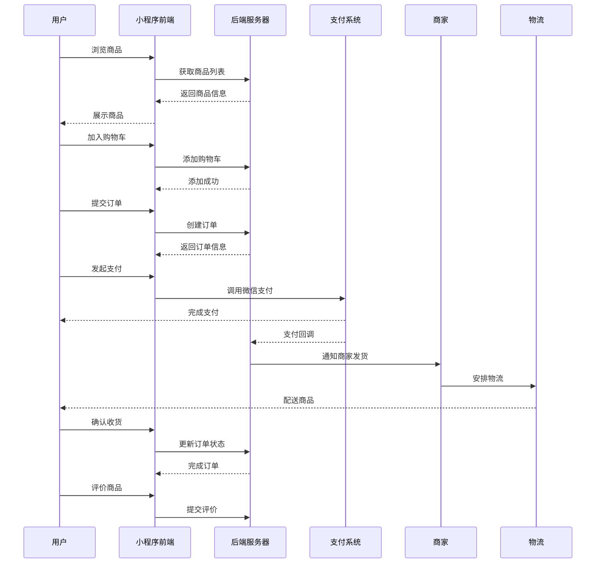


### 6.2 商家入驻流程

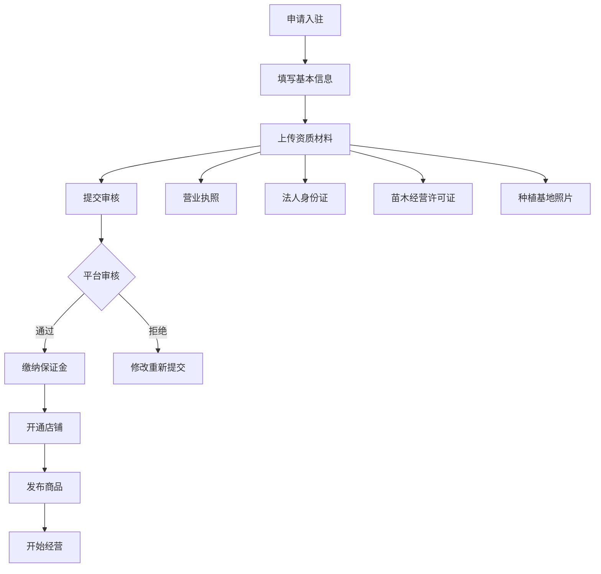


**入驻所需材料**：

| 材料 | 类型 | 说明 |
|------|------|------|
| 营业执照 | 图片 | 扫描件或照片 |
| 法人身份证 | 图片 | 正反面 |
| 苗木生产许可证 | 图片 | 如有 |
| 苗木经营许可证 | 图片 | 如有 |
| 种植基地照片 | 图片 | 3-5张实景照 |
| 联系人信息 | 文本 | 姓名、电话、微信 |

---

## 七、运营功能

### 7.1 营销工具

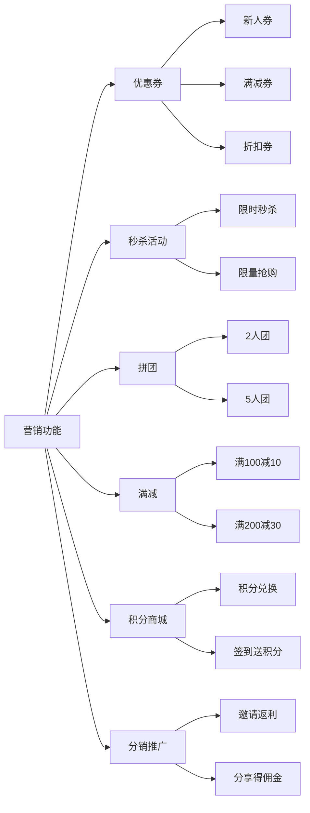


### 7.2 内容运营

| 栏目 | 内容类型 | 频率 |
|------|----------|------|
| 种植指南 | 图文教程 | 每周2篇 |
| 苗木百科 | 品种介绍 | 每周3篇 |
| 成功案例 | 客户案例 | 每周1篇 |
| 行业资讯 | 市场动态 | 每日更新 |
| 养护技巧 | 短视频 | 每周2个 |

---

## 八、技术架构

### 8.1 技术选型

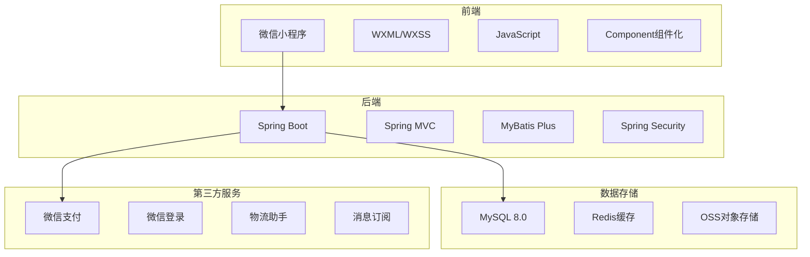


**技术栈明细**：

| 层级 | 技术 | 版本 | 说明 |
|------|------|------|------|
| 前端 | 微信小程序原生 | - | WXML、WXSS、JS |
| 前端UI | Vant Weapp | 最新版 | 组件库 |
| 后端框架 | Spring Boot | 2.7.x | 快速开发 |
| ORM | MyBatis Plus | 3.5.x | 数据访问 |
| 数据库 | MySQL | 8.0+ | 关系型数据库 |
| 缓存 | Redis | 6.x | 缓存、会话 |
| 文件存储 | 阿里云OSS | - | 图片、视频存储 |
| 支付 | 微信支付 | V3 | 小程序支付 |
| 部署 | Docker | - | 容器化部署 |

### 8.2 系统架构图

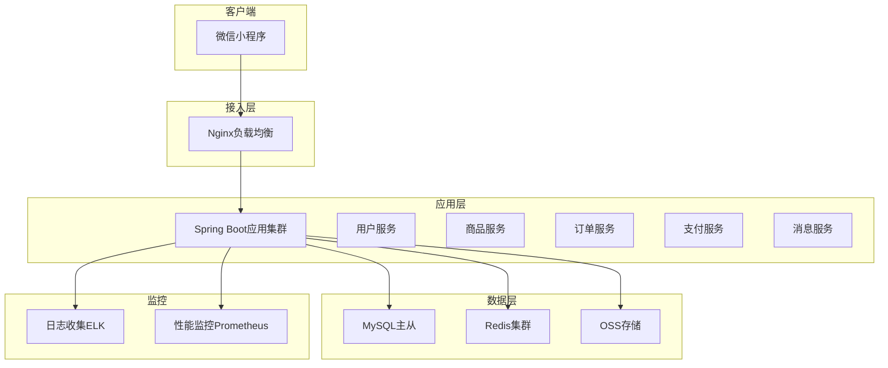


---

## 九、项目里程碑

### 9.1 开发计划

```mermaid
gantt
    title 苗木小程序开发计划
    dateFormat  YYYY-MM-DD
    section 需求与设计
    需求调研与分析      :done, req1, 2025-01-01, 7d
    UI/UX设计          :active, design1, 2025-01-08, 10d
    数据库设计          :db1, 2025-01-10, 5d
    
    section 后端开发
    基础框架搭建        :backend1, 2025-01-15, 5d
    用户模块            :backend2, after backend1, 5d
    商品模块            :backend3, after backend2, 7d
    订单模块            :backend4, after backend3, 7d
    支付模块            :backend5, after backend4, 5d
    
    section 前端开发
    小程序框架搭建      :frontend1, 2025-01-18, 3d
    首页与商品页        :frontend2, after frontend1, 7d
    购物车与订单        :frontend3, after frontend2, 7d
    个人中心            :frontend4, after frontend3, 5d
    
    section 测试与上线
    功能测试            :test1, 2025-02-15, 7d
    Bug修复            :fix1, after test1, 5d
    灰度发布            :release1, after fix1, 3d
    正式上线            :release2, after release1, 1d
```


### 9.2 版本规划

| 版本 | 时间 | 功能重点 |
|------|------|----------|
| V1.0 MVP | 第1个月 | 基础购物流程：浏览、下单、支付、发货 |
| V1.1 | 第2个月 | 商家端、评价系统、客服功能 |
| V1.2 | 第3个月 | 营销活动、优惠券、积分系统 |
| V1.3 | 第4个月 | 种植社区、内容板块、社交分享 |
| V2.0 | 第6个月 | 直播带货、AR识植物、AI推荐 |

---

## 十、风险评估与应对

### 10.1 风险识别

```mermaid
graph TB
    A[项目风险] --> B[技术风险]
    A --> C[运营风险]
    A --> D[市场风险]
    
    B --> B1[微信支付接入复杂]
    B --> B2[高并发性能问题]
    B --> B3[数据安全漏洞]
    
    C --> C1[商家入驻缓慢]
    C --> C2[商品质量管控]
    C --> C3[物流配送延误]
    
    D --> D1[竞争激烈]
    D --> D2[用户获取成本高]
    D --> D3[季节性波动]
```


### 10.2 应对措施

| 风险 | 影响程度 | 应对策略 |
|------|----------|----------|
| 支付安全问题 | 高 | 使用官方SDK，严格测试，购买保险 |
| 商家资源不足 | 高 | 提前招商，提供优惠政策，地推团队 |
| 物流损坏率高 | 中 | 制定包装标准，合作专业物流，购买保险 |
| 用户增长缓慢 | 中 | 多渠道推广，社交裂变，内容营销 |
| 技术性能瓶颈 | 中 | 压力测试，CDN加速，缓存优化 |
| 季节性销售波动 | 低 | 淡季促销，预售模式，多样化品类 |

---

## 十一、成功指标（KPI）

### 11.1 业务指标

| 指标 | V1.0目标 | V2.0目标 | 测量周期 |
|------|----------|----------|----------|
| 注册用户数 | 5,000 | 50,000 | 累计 |
| 日活跃用户(DAU) | 500 | 5,000 | 日均 |
| 入驻商家数 | 50 | 500 | 累计 |
| 上架商品数 | 1,000 | 10,000 | 累计 |
| 月交易额(GMV) | ¥10万 | ¥100万 | 月度 |
| 订单转化率 | 3% | 5% | 月度 |
| 客单价 | ¥150 | ¥200 | 月度 |
| 复购率 | 20% | 35% | 月度 |
| 用户满意度 | 4.5分 | 4.8分 | 季度 |

### 11.2 技术指标

| 指标 | 目标值 | 监控方式 |
|------|--------|----------|
| 系统可用率 | ≥ 99.5% | 监控系统 |
| API响应时间 | < 1秒 | APM工具 |
| 错误率 | < 0.1% | 日志分析 |
| 崩溃率 | < 0.05% | 小程序后台 |

---

## 十二、附录

### 12.1 术语解释

| 术语 | 解释 |
|------|------|
| SKU | Stock Keeping Unit，库存量单位，指商品的具体规格 |
| GMV | Gross Merchandise Volume，商品交易总额 |
| DAU | Daily Active Users，日活跃用户数 |
| ARPU | Average Revenue Per User，每用户平均收入 |
| CDN | Content Delivery Network，内容分发网络 |

### 12.2 参考文档

- 《微信小程序开发文档》
- 《微信支付API文档》
- 《GB/T 35273-2020 信息安全技术 个人信息安全规范》
- 《电子商务法》

### 12.3 联系方式

| 角色 | 负责人 | 联系方式 |
|------|--------|----------|
| 产品经理 | XXX | xxx@xxx.com |
| 技术负责人 | XXX | xxx@xxx.com |
| UI设计师 | XXX | xxx@xxx.com |

---

## 📝 文档修订记录

| 版本 | 日期 | 修订内容 | 修订人 |
|------|------|----------|--------|
| V1.0 | 2025-01-15 | 初始版本创建 | XXX |

---

这份需求文档涵盖了苗木售卖微信小程序的完整功能设计、技术方案、运营策略等内容。你可以根据实际项目情况进行调整和补充。如果需要我针对某个模块进行更详细的说明，或者生成具体的原型图、API文档等，请随时告诉我！