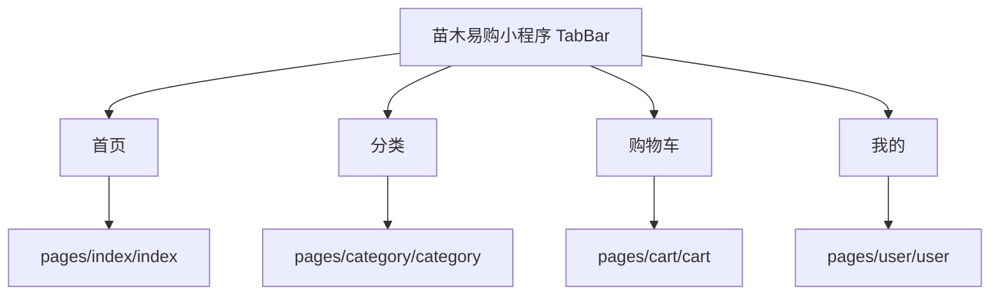
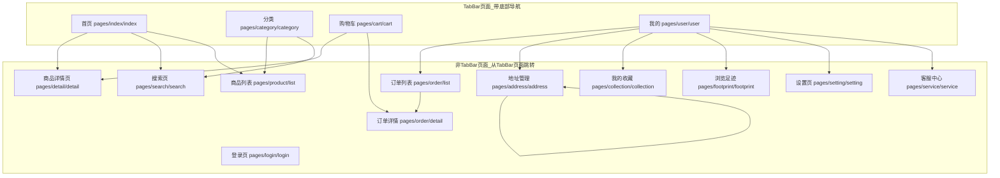
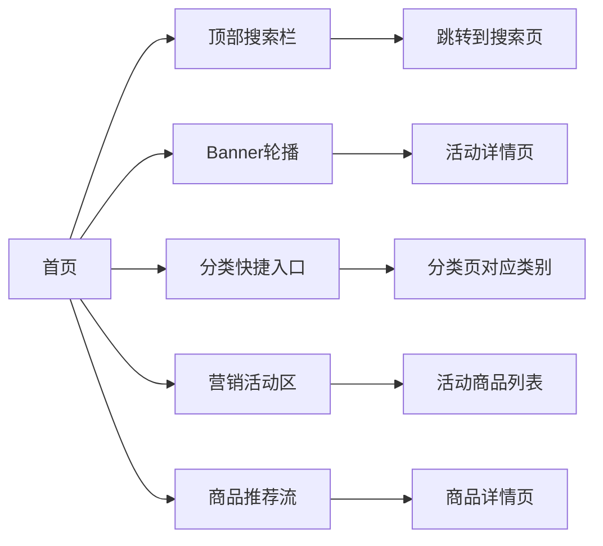
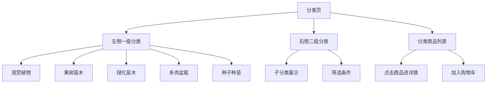
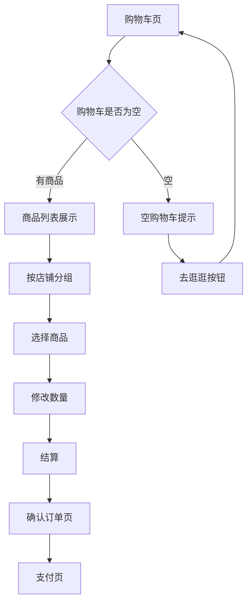
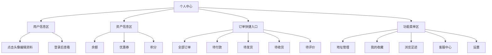
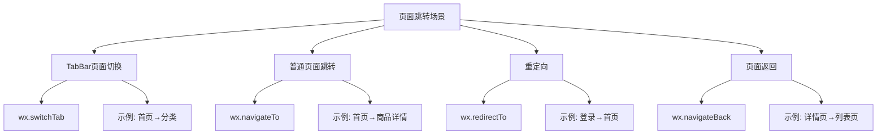
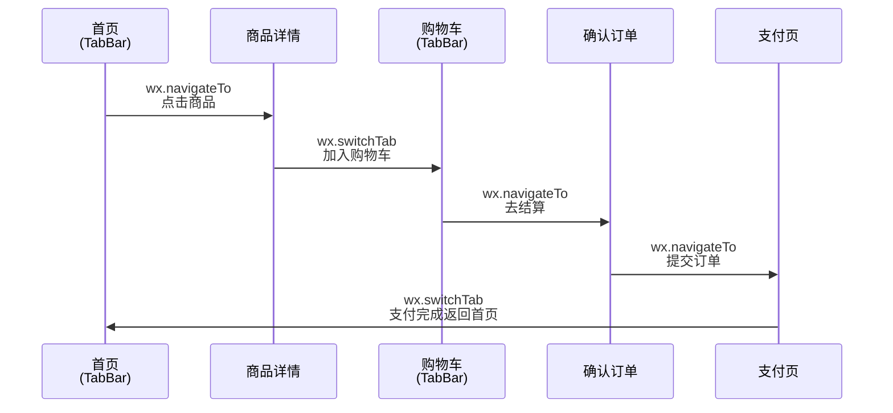
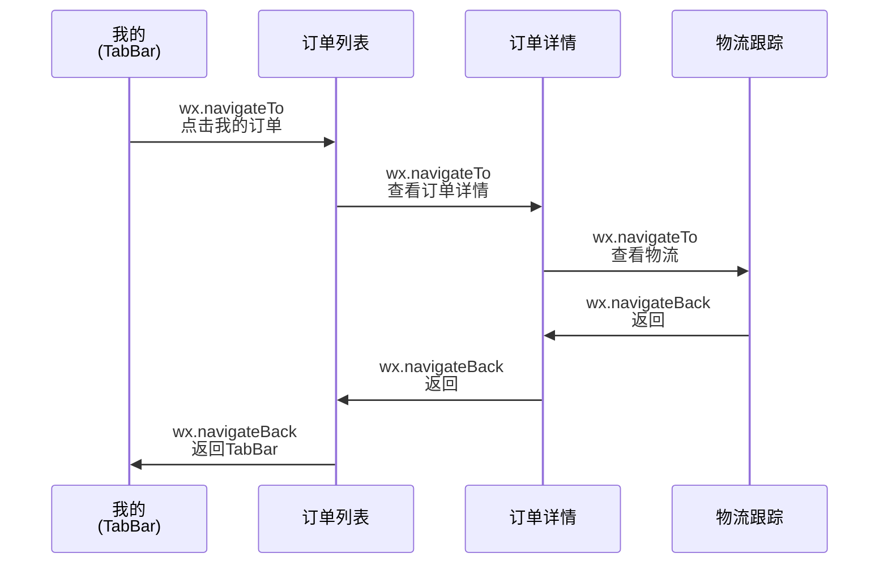
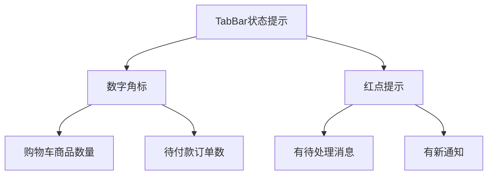

## 📱 优化后的 TabBar 设计方案

### 一、TabBar 整体架构

根据微信小程序规范，底部 TabBar 最多支持 **5 个**（你要求最多 4 个），我为你设计了以下方案：




### 二、TabBar 详细配置

#### 2.1 TabBar 基本信息

| Tab序号 | 图标 | 名称 | 页面路径 | 功能定位 |
|---------|------|------|----------|----------|
| 1 | 🏠 | 首页 |  `pages/index/index` | 商品浏览、推荐、活动 |
| 2 | 📑 | 分类 | `pages/category/category` | 按类别浏览苗木 |
| 3 | 🛒 | 购物车 | `pages/cart/cart` | 已选商品管理 |
| 4 | 👤 | 我的 | `pages/user/user` | 个人中心、订单管理 |

#### 2.2 TabBar 样式配置

```json
{
  "tabBar": {
    "color": "#999999",
    "selectedColor": "#07C160",
    "backgroundColor": "#ffffff",
    "borderStyle": "white",
    "list": [
      {
        "pagePath": "pages/index/index",
        "text": "首页",
        "iconPath": "images/tabbar/home.png",
        "selectedIconPath": "images/tabbar/home-active.png"
      },
      {
        "pagePath": "pages/category/category",
        "text": "分类",
        "iconPath": "images/tabbar/category.png",
        "selectedIconPath": "images/tabbar/category-active.png"
      },
      {
        "pagePath": "pages/cart/cart",
        "text": "购物车",
        "iconPath": "images/tabbar/cart.png",
        "selectedIconPath": "images/tabbar/cart-active.png"
      },
      {
        "pagePath": "pages/user/user",
        "text": "我的",
        "iconPath": "images/tabbar/user.png",
        "selectedIconPath": "images/tabbar/user-active.png"
      }
    ]
  }
}
```


**样式说明**：

| 属性 | 值 | 说明 |
|------|-----|------|
| color | #999999 | 未选中时的文字颜色（灰色） |
| selectedColor | #07C160 | 选中时的文字颜色（绿色） |
| backgroundColor | #ffffff | TabBar 背景色（白色） |
| borderStyle | white | 上边框颜色（white/black） |

---

### 三、TabBar 页面层级结构




**重要说明**：
- ✅ **TabBar 页面**：可以通过 `wx.switchTab` 相互切换，始终显示底部导航
- ❌ **非 TabBar 页面**：通过 `wx.navigateTo` 打开，隐藏底部导航，需要返回才能看到 TabBar

---

### 四、各 TabBar 页面详细功能映射

#### 4.1 首页 Tab（pages/index/index）




**包含的功能模块**：

| 模块 | 交互行为 | 跳转页面 |
|------|----------|----------|
| 搜索框 | 点击输入 | `pages/search/search` |
| Banner轮播 | 点击图片 | 活动详情页或商品详情 |
| 分类图标 | 点击图标 | `pages/category/category` 对应分类 |
| 限时特惠 | 点击查看 | `pages/product/list?type=seckill` |
| 新品上架 | 点击查看 | `pages/product/list?type=new` |
| 热门推荐 | 点击商品 | `pages/detail/detail?id=xxx` |
| 瀑布流商品 | 点击商品 | `pages/detail/detail?id=xxx` |

---

#### 4.2 分类 Tab（pages/category/category）




**页面布局**：
```
┌─────────────────────────┐
│ 🔍 搜索苗木              │
├──────────┬──────────────┤
│ 观赏植物 │ [全部] [桂花] │
│ 果树苗木 │ [樱花] [桃花] │
│ 绿化苗木 │ [香樟] [银杏] │
│ 多肉盆栽 │              │
│ 种子种苗 │  商品网格展示  │
│          │              │
│          │ ┌──┐ ┌──┐   │
│          │ │图│ │图│   │
│          │ └──┘ └──┘   │
└──────────┴──────────────┘
```


**功能映射**：

| 操作 | 结果 | 说明 |
|------|------|------|
| 点击左侧分类 | 右侧更新子分类 | 联动效果 |
| 点击子分类 | 下方展示商品 | 可滚动加载 |
| 点击商品 | 进入详情页 | `pages/detail/detail` |
| 点击搜索框 | 进入搜索页 | `pages/search/search` |

---

#### 4.3 购物车 Tab（pages/cart/cart）




**页面状态流转**：

```
┌─────────────────────┐
│  有商品状态          │
├─────────────────────┤
│ ☑️ 全选  ✏️ 编辑     │
│ 🏪 店铺A             │
│ ☑️ 商品1 ¥88 × 2    │
│ ☑️ 商品2 ¥45 × 1    │
│ 🏪 店铺B             │
│ ☑️ 商品3 ¥68 × 3    │
│                     │
│ 合计: ¥289.00       │
│ [去结算(6)]          │
└─────────────────────┘

┌─────────────────────┐
│  空购物车状态        │
├─────────────────────┤
│      🛒             │
│  购物车是空的~       │
│  快去挑选心仪的苗木吧 │
│                     │
│   [去逛逛]          │
└─────────────────────┘
```


**功能映射**：

| 操作 | 结果 | 跳转页面 |
|------|------|----------|
| 点击商品图片 | 查看商品详情 | `pages/detail/detail` |
| 点击 +/- | 修改数量 | 当前页更新 |
| 点击删除 | 移除商品 | 当前页更新 |
| 点击去结算 | 创建订单 | `pages/order/confirm` |
| 点击进店 | 查看店铺商品 | `pages/shop/shop` |

---

#### 4.4 我的 Tab（pages/user/user）




**功能菜单映射表**：

| 菜单项 | 图标 | 跳转页面 | 说明 |
|--------|------|----------|------|
| 我的订单 | 📦 | `pages/order/list` | 查看全部订单 |
| 待付款 | 💰 | `pages/order/list?status=0` | 待支付订单 |
| 待发货 | 📮 | `pages/order/list?status=1` | 已付款待发货 |
| 待收货 | 🚚 | `pages/order/list?status=2` | 运输中订单 |
| 待评价 | ⭐ | `pages/order/list?status=3` | 已完成待评价 |
| 地址管理 | 📍 | `pages/address/list` | 收货地址管理 |
| 我的收藏 | ❤️ | `pages/collection/collection` | 收藏的商品 |
| 浏览足迹 | 👀 | `pages/footprint/footprint` | 最近浏览 |
| 优惠券 | 🎫 | `pages/coupon/coupon` | 我的优惠券 |
| 积分商城 | 🎁 | `pages/points/mall` | 积分兑换 |
| 客服中心 | 📞 | `pages/service/service` | 在线客服 |
| 设置 | ⚙️ | `pages/setting/setting` | 账号设置 |

---

### 五、页面跳转规则总结

#### 5.1 跳转方式对照表




| 跳转类型 | API | 使用场景 | 是否保留历史 |
|----------|-----|----------|--------------|
| Tab切换 | `wx.switchTab` | 在4个TabBar页面间切换 | ❌ 不保留 |
| 新页面 | `wx.navigateTo` | 打开非TabBar页面 | ✅ 保留 |
| 重定向 | `wx.redirectTo` | 替换当前页面 | ❌ 不保留 |
| 返回 | `wx.navigateBack` | 返回上一页 | - |
| 重启 | `wx.reLaunch` | 关闭所有页面重新打开 | ❌ 清空 |

#### 5.2 典型跳转流程示例

**示例1：从首页浏览到下单**



**示例2：从个人中心查看订单**



---

### 六、完整页面路由表

| 页面名称 | 页面路径 | 是否TabBar | 说明 |
|----------|----------|-----------|------|
| **首页** | `pages/index/index` | ✅ 是 | TabBar第1项 |
| **分类** | `pages/category/category` | ✅ 是 | TabBar第2项 |
| **购物车** | `pages/cart/cart` | ✅ 是 | TabBar第3项 |
| **我的** | `pages/user/user` | ✅ 是 | TabBar第4项 |
| 商品详情 | `pages/detail/detail` | ❌ 否 | 从首页/分类/购物车进入 |
| 搜索页 | `pages/search/search` | ❌ 否 | 从搜索框进入 |
| 商品列表 | `pages/product/list` | ❌ 否 | 从分类/搜索进入 |
| 订单列表 | `pages/order/list` | ❌ 否 | 从个人中心进入 |
| 订单详情 | `pages/order/detail` | ❌ 否 | 从订单列表进入 |
| 确认订单 | `pages/order/confirm` | ❌ 否 | 从购物车进入 |
| 支付页 | `pages/payment/payment` | ❌ 否 | 从确认订单进入 |
| 地址管理 | `pages/address/list` | ❌ 否 | 从个人中心/确认订单进入 |
| 地址编辑 | `pages/address/edit` | ❌ 否 | 从地址列表进入 |
| 我的收藏 | `pages/collection/collection` | ❌ 否 | 从个人中心进入 |
| 浏览足迹 | `pages/footprint/footprint` | ❌ 否 | 从个人中心进入 |
| 优惠券 | `pages/coupon/coupon` | ❌ 否 | 从个人中心进入 |
| 客服聊天 | `pages/service/chat` | ❌ 否 | 从客服入口进入 |
| 设置 | `pages/setting/setting` | ❌ 否 | 从个人中心进入 |
| 个人资料 | `pages/profile/profile` | ❌ 否 | 从设置进入 |
| 登录页 | `pages/login/login` | ❌ 否 | 需要登录时弹出 |
| 店铺主页 | `pages/shop/shop` | ❌ 否 | 从商品详情/订单进入 |

---

### 七、TabBar 角标与红点提示




**角标配置规则**：

| Tab | 角标类型 | 显示内容 | 数据来源 |
|-----|----------|----------|----------|
| 首页 | 无 | - | - |
| 分类 | 无 | - | - |
| 购物车 | 数字角标 | 商品总数量 | 购物车表统计 |
| 我的 | 红点 | 新消息提示 | 消息中心未读数 |

**实现代码示例**：
```javascript
// 更新购物车角标
wx.setTabBarBadge({
  index: 2, // 购物车Tab索引（从0开始）
  text: cartCount.toString() // 显示数量
})

// 移除角标
wx.removeTabBarBadge({
  index: 2
})

// 显示红点
wx.showTabBarRedDot({
  index: 3 // 我的Tab
})
```


---

### 八、优化后的文档补充说明

在原文档的 **"二、功能需求"** 部分，建议增加以下章节：

#### 2.5 底部导航栏（TabBar）设计

**设计理念**：简洁直观，快速触达核心功能

```
┌─────────────────────────┐
│                         │
│     页面主要内容区域      │
│                         │
├─────────────────────────┤
│  🏠    📑    🛒    👤   │
│ 首页  分类  购物车  我的  │
└─────────────────────────┘
```


**设计原则**：
1. ✅ **高频优先**：将最常用的功能放在TabBar
2. ✅ **层次清晰**：主要功能直接访问，次要功能二级入口
3. ✅ **命名简洁**：每个名称2-4个字，易于理解
4. ✅ **图标统一**：线性风格，大小一致，选中变色
5. ✅ **数量精简**：控制在4个，避免过多分散注意力

**为什么这样设计**：

| Tab | 选择理由 | 替代方案考虑 |
|-----|----------|--------------|
| 首页 | 流量入口，商品展示 | 必选项 |
| 分类 | 快速查找品类 | 可合并到首页，但会降低效率 |
| 购物车 | 转化关键环节 | 必选项 |
| 我的 | 订单管理、个人信息 | 必选项 |

**排除的Tab选项**：
- ❌ **发现/社区**：V1.0版本暂不上线，后续版本可增加
- ❌ **消息**：整合到"我的"页面中
- ❌ **商家**：商家端独立小程序或Web端管理

---

这样优化后，文档更加清晰地展示了：
1. ✅ **TabBar的4个名称**：首页、分类、购物车、我的
2. ✅ **页面与TabBar的关联**：明确了哪些是TabBar页面，哪些是从TabBar页面跳转的子页面
3. ✅ **符合微信规范**：TabBar数量为4个（≤4的要求）
